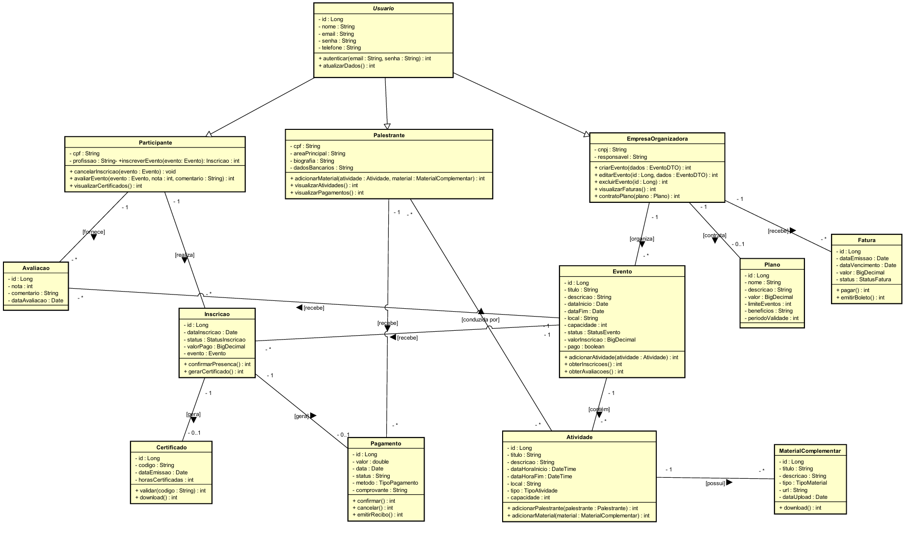
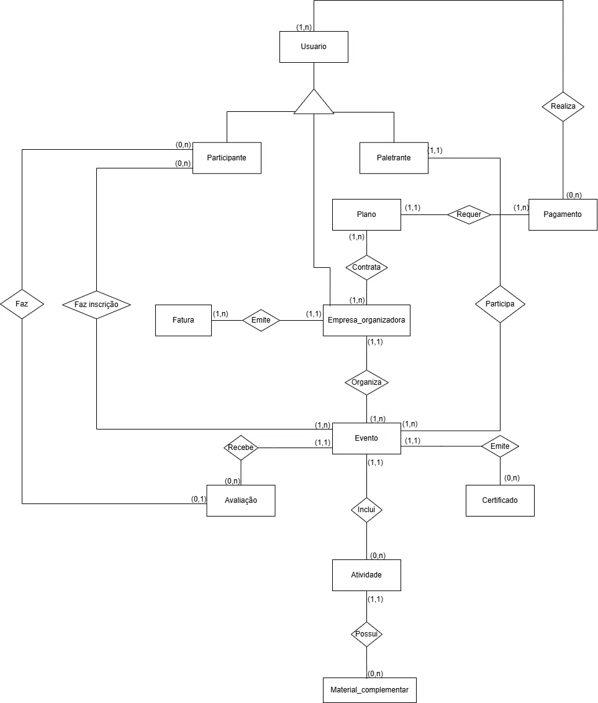

# Empreventos 

Projeto de WEB II - APIREST com Spring Boot 
> O objetivo deste sistema é fornecer uma API REST robusta e escalável para o gerenciamento de eventos empresariais, com foco em palestras e workshops. A plataforma permite que empresas organizadoras possam criar e gerenciar eventos, controlar atividades, inscrições de participantes, registro e remuneração de palestrantes, além de fornecer relatórios, certificados e controle financeiro. O sistema visa oferecer uma solução eficiente, segura e de fácil integração com frontends diversos ou sistemas terceiros.
>> Responsáveis: Leonan Damasceno, Marlon Neves, Maysa Santos.
> >* Contato: Damascenoleonan@gmail.com, marlonmota2019@gmail.com, maysamkt@hotmail.com.

## - Configuração

>* SpringBoot 3.4.5
>* Java 21
>* DataBase mysql empreventos (criar separadamente)

## - Público-Alvo

>O sistema é destinado a três principais grupos de usuários:
>* Empresas Organizadoras: instituições que promovem eventos empresariais como conferências, feiras, seminários, workshops e palestras corporativas.
>* Palestrantes: profissionais que atuam como facilitadores ou instrutores em eventos, fornecendo conteúdo e conduzindo atividades.
>* Participantes: profissionais, colaboradores de empresas ou estudantes interessados em participar de eventos empresariais para aprendizado e networking.

## - Requisitos do Sistema

### - Tabela de Requisitos Funcionais 

|Código| Descrição|
|---|---|
|RF01| O  sistema deve permitir o cadastro de usuários com papéis: participante, palestrante e empresa organizadora.|
|RF02| O sistema deve permitir login e logout seguros com autenticação baseada em tokens ( JWT).|
|RF03| O sistema deve permitir a visualização e atualização dos dados do usuário logado conforme seu papel.|
|RF04| O sistema deve permitir que empresas organizadoras criem, editem e excluam  eventos.|
|RF05| O sistema deve permitir a associação de atividades (palestras ou workshops) aos eventos.|
|RF06| O sistema deve permitir o cadastro de palestrantes em atividades.|
|RF07| O sistema deve permitir que participantes se inscrevam em eventos.|
|RF08| O sistema deve permitir o gerenciamento do status de inscrição (pendente, confirmada).|
|RF09| O sistema deve permitir a emissão de certificados para participantes com inscrição confirmada e que tenham participado de algum evento.|
|RF10| O sistema deve permitir que palestrantes adicionem materiais complementares às suas atividades se for preciso.|
|RF11| O sistema deve permitir que participantes avaliem eventos com notas e comentários.|
|RF12| O sistema deve registrar pagamentos feitos por participantes para inscrição em eventos pagos.|
|RF13| O sistema deve registrar pagamentos feitos para palestrantes por participação em atividades.|
|RF14| O sistema deve gerar faturas mensais para empresas organizadoras com base nos planos contratados e eventos criados.|
|RF15| O sistema deve permitir que empresas organizadoras contratem planos com diferentes valores e benefícios.|

### - Tabela de Requisitos Não Funcionais
| Código | Descrição                                                                                                                  |
|--------|----------------------------------------------------------------------------------------------------------------------------|
| RNF01  | A API deve ser desenvolvida utilizando Spring Boot, seguindo arquitetura RESTful.                                          |
| RNF02  | O sistema deve utilizar segurança baseada em JWT para autenticação e autorização.                                          |
| RNF03  | A base de dados deve ser modelada em um SGBD relacional ( MySQL).                                                          |
| RNF04  | As respostas da API devem seguir o padrão JSON para facilitar o consumo por clientes externos.                             |
| RNF05  | A aplicação deve seguir o princípio da separação de responsabilidades ( Controller, Service, Repository).                  |
| RNF06  | A documentação da API deve ser gerada automaticamente via Swagger.                                                         |
| RNF07  | O sistema deve ser escalável, com suporte futuro para outros meios de pagamento.                                           |
| RNF08  | O sistema deve manter logs de atividades administrativas e financeiras.                                                    |
| RNF09  | A performance das consultas deve ser otimizada com o uso de índices nos campos de busca e relacionamento.                  |
| RNF10  | A aplicação deve ser testada com cobertura mínima de 80% nas funcionalidades críticas (cadastro, autenticação, pagamento). |

## - Diagrama de Classes

## - Diagrama Entidade Relacionamento

## - Esta API Está sendo desenvolvida para a disciplina de WEB II do Instituto Federal Goiano
